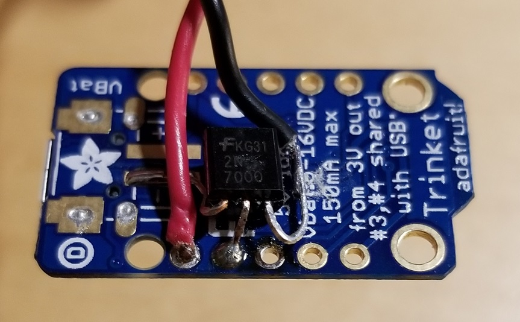
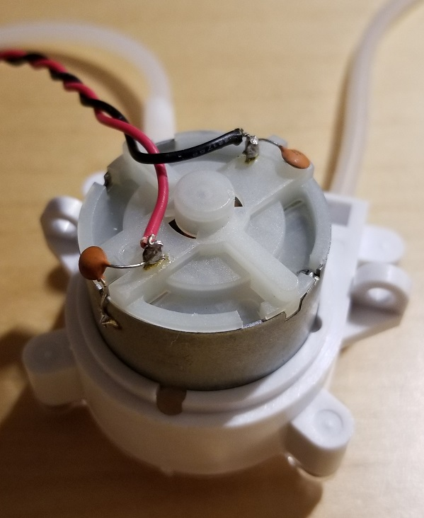

## BOM
| Qty | Item | Price |
| --- | ---- | ----- |
| 1 | [Water pump](https://www.aliexpress.com/item/6V-DC-Dosing-pump-Peristaltic-Dosing-Head-For-Aquarium-Lab-Analytical-Water-with-Water-Pipe-Peristaltic/32810184952.html) | $8.20 |
| 1 | [Trinket 5V](https://www.adafruit.com/product/1501) | $6.95 |
| 1 | [2N7000 FET](https://www.digikey.com/product-detail/en/on-semiconductor/2N7000-D26Z/2N7000-D26ZCT-ND/2094402) | $0.51 |
| 2 | [0.1uF leaded ceramic cap](https://www.digikey.com/product-detail/en/vishay-bc-components/A104K15X7RF5TAA/1109PHCT-ND/145913) (optional) | $0.24 |
| Cut to length | Red wire, 24 AWG | ? |
| Cut to length | Black wire, 24 AWG | ? |
| Cut to length | Plastic tubing | ? |
| 2 | Fittings for tubing, straight | ? |
| 1 | Fittings for tubing, right angle | ? |
| 1 | USB A to Micro-B cable | ? |
| 1 | USB supply 1A | ? |

## Wiring

- 2N7000 pin 1 (source) to GND, use ground pad from battery connector
- 2N7000 pin 2 (gate) to Trinket GPIO #0
- 2N7000 pin 3 (drain) to motor negative
- Motor positive to Trinket USB pin

## Motor modifications

- Solder 0.1uF cap from metal motor body to motor input terminal, for both positive and negative terminals.

## Trinket modifications
- Remove green power LED (to keep LED from disturbing sleep)
